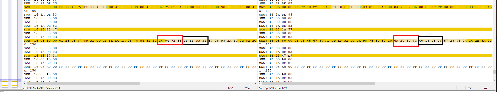

# BQ40Z50_keyExtraction

The BQ40Z50 and likely most (if not all) BQs from Texas Instrument can be configured and accessed via 'Battery Management Studio' from TI.

In most recent BQStudio versions, an unsealed BQ can be read out as .srec or .bq.fs file.

The 'unseal' as well as 'unseal full access' key can be easily extracted when a .bq.fs file is available.
Therefore, e.g. the original TI image is compared with WinMerge 

and as the original keys are '36 72 04 14' and 'FF FF FF FF' the pattern can be easily found.
Important to note is that the byte order is reverse.
In the image, in red is the 'unseal' and in black the 'unseal full access' key marked. The right windows shows another .bq.fs file with different keys.
For this image, the key is '6C 69 20 6F' and '26 43 18 40'.

If a new image .bq.fs image is flashed onto the BQ, the existing keys are overwritten. Thus, an BQ which is sealed can be unsealed permanently by flashing a new image.

There are few people which claims that they can unlock arbitrary sealed BQs and by reading out the image, the keys can be extracted.